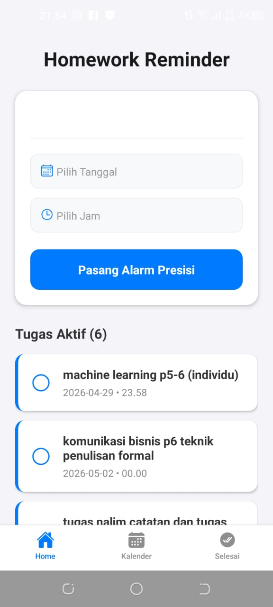
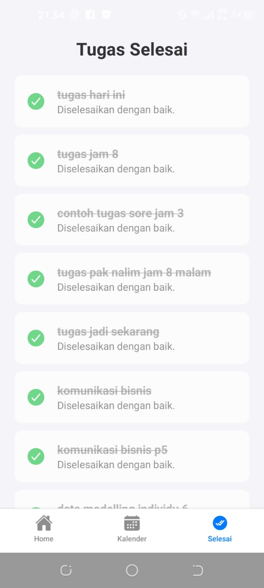
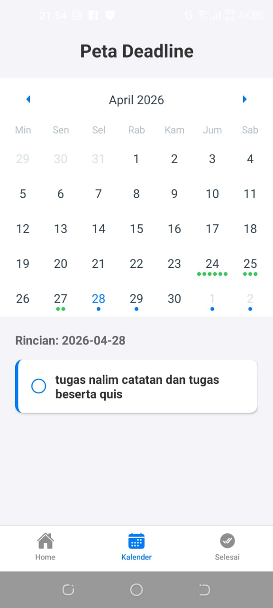

# 📚 Homework Reminder

**Homework Reminder** adalah aplikasi mobile lintas platform (Android & iOS) yang dirancang khusus untuk membantu mahasiswa mengelola tenggat waktu (deadline) tugas kuliah dengan presisi tinggi. Berbeda dengan aplikasi to-do list biasa, aplikasi ini menggunakan strategi **Native Sync** untuk mengintegrasikan jadwal langsung ke kalender sistem dengan sistem pengingat berlapis.

## ✨ Fitur Utama

* **Precision Scheduling**: Input nama tugas, tanggal, hingga jam deadline yang spesifik menggunakan `DateTimePicker`.
* **Defense in Depth (Multi-layered Alarms)**: Strategi pengingat 4 tahap:
    * **H-2 (48 jam):** Persiapan awal dan riset data.
    * **H-1 (24 jam):** Peringatan kritis untuk penyelesaian dokumen.
    * **1 Jam Sebelum:** *Final check* dan persiapan pengiriman/upload.
    * **On Time:** Notifikasi tepat saat waktu deadline berakhir.
* **Native Calendar Sync**: Sinkronisasi otomatis ke Google Calendar atau Apple Calendar menggunakan **Native Intent** dan **Expo Calendar API**.
* **Local Persistence**: Data tersimpan aman di penyimpanan lokal perangkat menggunakan `AsyncStorage`.
* **One-tap Completion**: Fitur checklist instan untuk membersihkan daftar tugas yang sudah selesai.

## 🛠️ Tech Stack

* **Framework**: [React Native](https://reactnative.dev/) dengan [Expo SDK](https://expo.dev/)
* **Language**: [TypeScript](https://www.typescriptlang.org/) (Type-safe development)
* **Native Modules**: 
    * `expo-calendar` & `expo-intent-launcher` (Calendar Integration)
    * `expo-notifications` (Internal Push Notifications)
    * `@react-native-async-storage/async-storage` (Local DB)
    * `@react-native-community/datetimepicker` (Input UI)

## 📱 Version History & Changelog

### v4.0.0 (Latest Release - Final Implementation)
* **Multi-layered Alarms**: Implementasi pertahanan berlapis (H-2, H-1, 2 Jam, dan 1 Jam sebelum deadline) berdasarkan evaluasi pengguna.
* **Bulletproof Calendar Logic**: Algoritma pencarian kalender adaptif untuk mendeteksi akun Google/Primary secara otomatis di berbagai perangkat Android.

### v3.0.0 (Beta - System Sync)
* **Initial Calendar Sync**: Sinkronisasi pertama ke sistem Android, namun prosedur peringatan dinilai terlalu mepet (hanya 1 jam sebelum). *Telah direvisi pada v4.0.0.*

### v1.0.0 - v2.0.0 (Foundation)
* Integrasi UI dasar, `AsyncStorage`, dan `DateTimePicker`.

## 🚀 Cara Menjalankan (Local Development)

1.  **Clone Repositori**
    ```bash
    git clone [https://github.com/Faiq13/Homework-Reminder.git](https://github.com/Faiq13/Homework-Reminder.git)
    cd homework-reminder
    ```

2.  **Instal Dependensi**
    ```bash
    npm install
    ```

3.  **Jalankan Project**
    ```bash
    npx expo start
    ```

4.  **Preview**
    Buka aplikasi **Expo Go** di Android/iOS dan scan QR Code yang muncul di terminal.

## 🤝 Kontribusi

Aplikasi ini bersifat **Open Source**. Kontribusi sangat diharapkan, terutama untuk pengembangan fitur di masa depan seperti:
* Integrasi Cloud Database (Firebase/Supabase).
* Visualisasi Statistik Tugas (Data Science Approach).
* Kategorisasi mata kuliah berdasarkan warna.

## 📄 Lisensi

Didistribusikan di bawah **MIT License**. Lihat file [LICENSE](https://github.com/Faiq13/Homework-Reminder/blob/main/LICENSE) untuk informasi lebih lanjut.

---
**Developed by [Faiq](https://github.com/Faiq13)** *Mahasiswa Sains Data - Pekalongan, Indonesia*


## 📱 Tampilan Aplikasi





